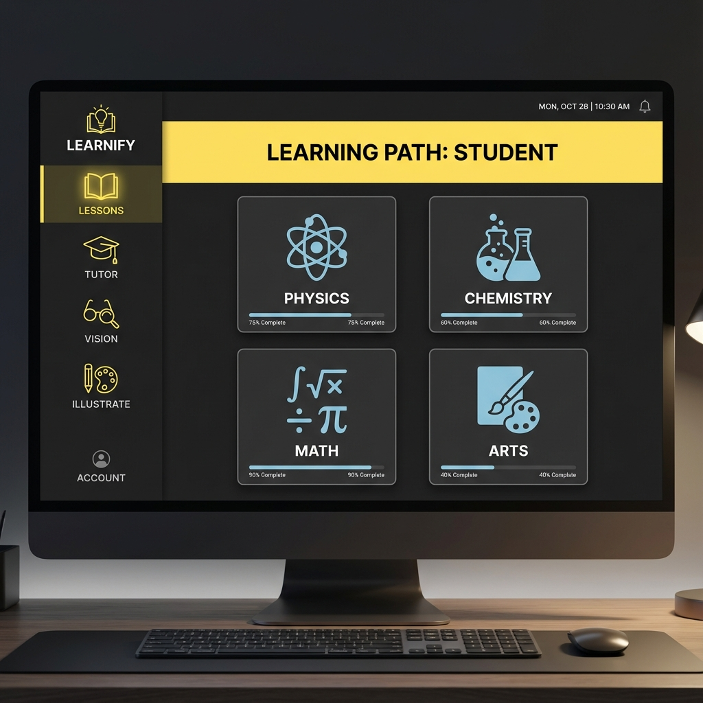
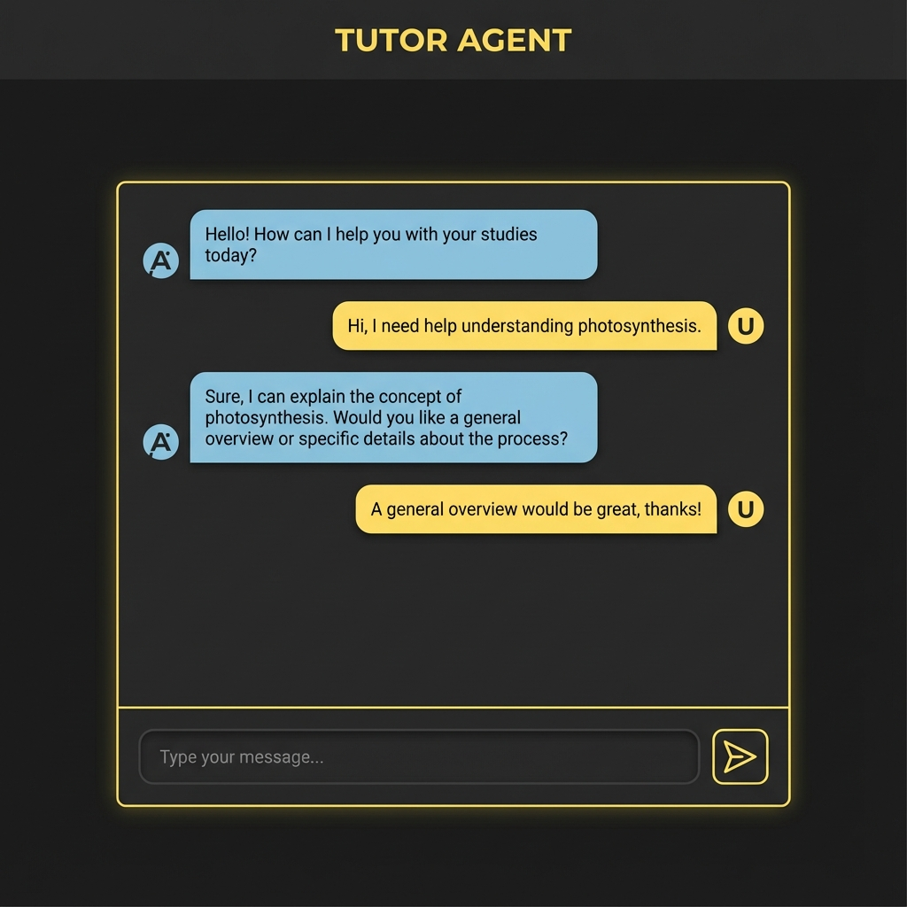

# Career Companion System (Alt-F4)

A gamified, AI-powered career guidance platform designed to help users navigate their professional journey through personalized personas and interactive agents.


## 🚀 Features

### 1. **Role-Based Experience (Personas)**
Choose your current career stage to get tailored content:
- **Student**: Focus on foundational subjects (Physics, Math, CS) and soft skills.
- **Fresher**: Resume building, interview prep, and corporate etiquette.
- **Experienced**: Leadership, system design, and career strategy.

### 2. **AI Agents**
Interact with specialized AI agents powered by Gemini:
- **📚 Lessons Agent**: Comprehensive learning modules for various subjects.
- **💬 Tutor Agent**: Interactive Q&A to clear doubts and deepen understanding.
- **👁️ Vision Agent**: Analyze visual content and diagrams.
- **🎨 Illustrate Agent**: Generate visual aids for complex concepts.



### 3. **Gamification**
Stay motivated with built-in mechanics:
- **XP System**: Earn experience points for completing lessons.
- **Streaks**: Daily engagement tracking.
- **Progress Tracking**: Visual indicators of your learning journey.

### 4. **Modern Authentication**
Secure and seamless access:
- **Google Sign-In**: Quick one-click access.
- **Email/Password**: Standard secure login.



## 🛠️ Tech Stack

- **Frontend**: React, TypeScript, Vite
- **Styling**: Tailwind CSS (Custom "Neo-Brutalist" Dark Theme)
- **Backend/Auth**: Firebase (Authentication, Firestore)
- **AI Integration**: Google Gemini API
- **Icons**: Lucide React

## 📦 Installation

1. **Clone the repository**
   ```bash
   git clone https://github.com/yourusername/Alt-F4.git
   cd Alt-F4
   ```

2. **Install dependencies**
   ```bash
   npm install
   ```

3. **Configure Environment**
   Create a `.env.local` file with your Firebase and Gemini keys:
   ```env
   VITE_FIREBASE_API_KEY=your_key
   VITE_FIREBASE_AUTH_DOMAIN=your_domain
   VITE_GEMINI_API_KEY=your_gemini_key
   ```

4. **Run Locally**
   ```bash
   npm run dev
   ```

## 🔒 Security Rules

The project uses Firestore Security Rules to ensure data privacy:
- Users can only read/write their own data.
- Strict schema validation for user profiles (XP, Streak, etc.).

## 🤝 Contributing

1. Fork the repo
2. Create your feature branch (`git checkout -b feature/amazing-feature`)
3. Commit your changes (`git commit -m 'Add some amazing feature'`)
4. Push to the branch (`git push origin feature/amazing-feature`)
5. Open a Pull Request
